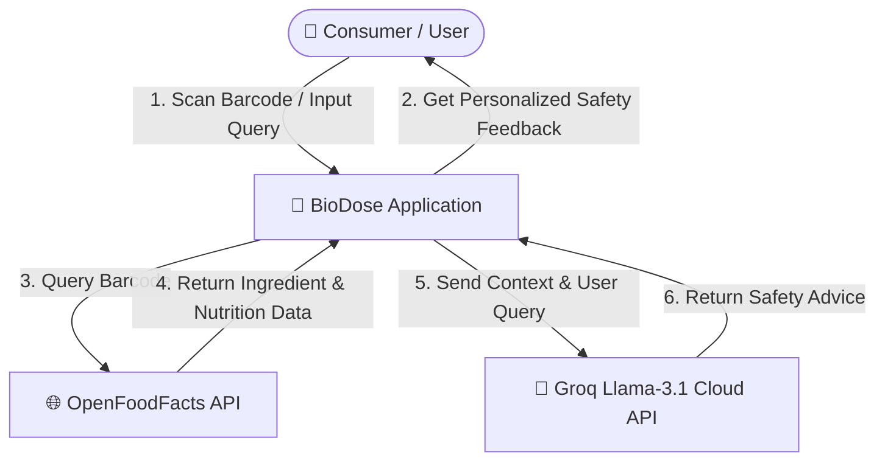
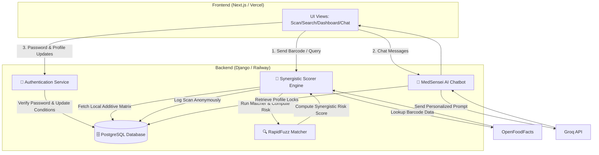
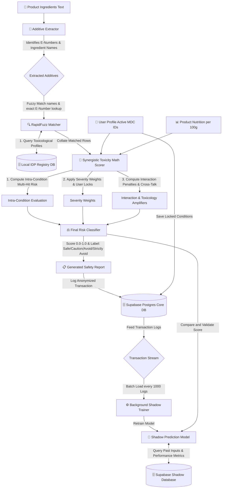
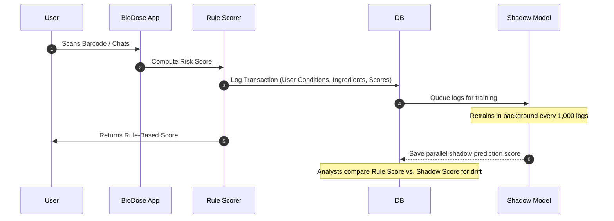

# 🛡️ BioDose — Intelligent Food Quality & Personalized Consumer Safety System

Welcome to **BioDose**, a next-generation, context-aware mobile and web application designed to evaluate food safety at a highly personalized level. 

Unlike generic fitness trackers and calorie counters that only evaluate basic macronutrient statistics (calories, proteins, fats), **BioDose** analyzes the exact chemical makeup, preservatives, colorants, and processing agents added to food products during manufacture and storage. It then maps these chemical exposure risks to **21 distinct health conditions** and flags potential toxicological reactions tailored specifically to the user's locked medical profile.

---

## 🗺️ System Data Flow Diagrams (DFD)

To understand how data propagates securely throughout the BioDose ecosystem, we have structured the architecture into three progressive Data Flow levels:

### 🔹 Level 0: Global Context Diagram
This diagram represents the boundary of the BioDose system and shows all external entities interacting with the application.

---

### 🔹 Level 1: Core System Architecture
This level decomposes the system into its primary subsystems: Barcode Processing, Scorer Engine, Profile Management, and the MedSensei Chatbot.

---

### 🔹 Level 2: Detailed Scorer, Matcher & Shadow Pipeline
This level zooms in on the scoring and shadow classification processes, detailing how ingredients are matched against local IDP dataset, logged to Supabase, and evaluated by the background shadow prediction service.

---

## 🧮 The Mathematics of Personalized Risk Scoring

The core of BioDose is its **Synergistic Risk Scoring Algorithm**, a multi-tiered mathematical model implemented in [scorer.py](file:///c:/Users/sirik/Desktop/BioDose/backend/apps/analysis/services/scorer.py). Unlike simple static lookup models, our scoring engine evaluates how multiple food additives interact with one another and with the user's specific health profile.

### 1. The Core Formulas
For each active condition $j$ registered in the user's profile:

*   **Intra-Condition Multi-Hit Risk ($R_j$)**:
    $$R_j = \min\left(1.0, \bar{S}_j \cdot \left(1 + \alpha \cdot (n_j - 1)\right)\right)$$
    *   $\bar{S}_j$: The average toxicological score of all detected ingredients flagging condition $j$ in the product.
    *   $n_j$: The total number of flagging ingredients detected.
    *   $\alpha$: The non-linear multi-hit synergy factor (set to `0.25`). This represents the compounding effect when multiple chemicals stress the same biological pathway simultaneously.

*   **Weighted User-Specific Condition Risk ($CR_j$)**:
    $$CR_j = R_j \cdot W_j \cdot P_j$$
    *   $W_j$: The severity tier weight of condition $j$ (Tier 1 = `1.0`, Tier 2 = `0.6`, Tier 3 = `0.3`).
    *   $P_j$: User profile presence variable ($1$ if the condition is active in the user's profile, $0$ otherwise).

*   **Cumulative Risk Score with Cross-Talk Penalty ($Final\_Score$)**:
    $$Final\_Score = \min\left(1.0, CR_{max} + \beta \cdot \sum_{k \neq max} CR_k\right)$$
    *   $CR_{max}$: The maximum risk score calculated among all active conditions.
    *   $\sum_{k \neq max} CR_k$: The sum of risk scores for all other active conditions.
    *   $\beta$: Cross-talk scaling coefficient (set to `0.15`) that factors in secondary triggers without causing excessive linear saturation.

---

### 2. Clinical and Mathematical Proofs of Legitimacy
Our mathematical approach is designed to model established toxicological and biological behaviors:

*   **Dose-Response Multi-Hit Hypothesis**: In clinical toxicology, the *Multi-Hit Hypothesis* states that chronic diseases are rarely triggered by a single chemical stressor in isolation; rather, they arise from multiple sub-threshold insults to the same system. The term $(1 + \alpha \cdot (n_j - 1))$ mathematically scales the risk to reflect this non-linear pathway stress.
*   **Cumulative Risk Assessment (CRA) Frameworks**: Guided by EPA and WHO standards, our final score formula uses the **Index Chemical / Relative Potency Factor (RPF)** technique combined with a cross-stressor interaction multiplier ($\beta$). This ensures that while the most severe threat ($CR_{max}$) dominates the evaluation, secondary active conditions still contribute proportionally to the risk.
*   **Tiered Clinical Severity Weighting**: Conditions are split into clinical severity tiers:
    *   **Tier 1 ($W = 1.0$)**: Instant/Severe reactions (e.g., Celiac Disease, Peanut Allergy, Shellfish Allergy, Dairy Allergy, Soy Allergy).
    *   **Tier 2 ($W = 0.6$)**: Chronic/Organ-damaging conditions (e.g., Diabetes Type 2, Hypertension, Kidney Disease, Liver Disease, Thyroid Disorders, Heart Disease, Autoimmune Conditions).
    *   **Tier 3 ($W = 0.3$)**: Mild/Functional conditions (e.g., Asthma, IBS, ADHD, Pregnancy, Lactation).

---

## 🔄 The Shadow Model Deployment Flywheel

BioDose operates in a domain with limited pre-existing clinical data: the intersection of food additive toxicology and personalized patient profiles. To build and refine our predictive capabilities, we utilize a **Shadow Model Deployment Strategy** inspired by recommendation systems used by Amazon, Flipkart, and Netflix.

### Key Subsystems:
1.  **Interaction Curation**: Every scan, user profile mapping, and rule-based risk score is logged anonymously in the background via a non-blocking daemon thread ([views.py](file:///c:/Users/sirik/Desktop/BioDose/backend/apps/analysis/views.py)) to prevent API delays.
2.  **Every-1000 Retraining Loop**: A background worker constantly aggregates these interaction logs. Every **1,000 new records**, the system triggers a retraining loop of a Deep Learning **Shadow Model** (neural network classifier).
3.  **Shadow Evaluation**: The shadow model runs in parallel to the rule engine. When a product is scanned, both the math scorer and the shadow model calculate a risk score. The shadow model's prediction is logged silently without user-facing impact.
4.  **High-Availability Failover**: To prevent system downtime, multiple shadow models run in parallel. In the event of a model corruption or crash, the container immediately fails over to an adjacent shadow model without interrupting the core application services.

---

## 🧠 MedSensei AI: Custom Chatbot Architecture

**MedSensei AI** is our custom, context-aware chatbot designed specifically to answer food safety and dietary questions. Rather than behaving like a standard GPT clone, MedSensei utilizes local context detection:

1.  **Dual-Point Contextual Access**:
    *   *Global Mode*: Opened directly from the dashboard. MedSensei initializes as a general safety consultant, reading the user's age and locked profile conditions into its system prompt.
    *   *Product Mode*: Accessed immediately after scanning a product. MedSensei automatically inherits the active product's barcode context, name, brand, and matched additive list from the session state. The user can type questions like *"what is harmful in this?"* or *"will this react with my medicines?"* without manually inputting product details.
2.  **Groq Cloud API & Offline Fallback**:
    *   In normal operation, MedSensei leverages **Groq's Cloud Inference API** running the `llama-3.1-8b-instant` model for fast, conversational responses.
    *   *Device Compatibility Clause*: We do not run heavy local tokenizers or transformers directly on the user's mobile device. Doing so would bloat the application bundle by gigabytes and cause thermal throttling or memory crashes on consumer mobile phones. 
    *   Instead, if the Groq API key is missing or the network is blocked (e.g. Jio DNS block issues), the app automatically triggers our **Offline Rule-Based Expert Parser**, answering using the local IDP database and product logs.

---

## 🔒 Security-First Profile Locks (Design Beauty)

To guarantee patient data privacy and prevent unauthorized modifications to critical health settings (such as a friend turning off an allergen toggle as a prank when a device is left unlocked), BioDose enforces a **secure password barrier** for profile edits.

*   When the chatbot suggests adding a new condition (e.g., `[SUGGEST_CONDITION: MDC19]`), or when changes are saved in the profile settings, the frontend renders a password-locked confirmation overlay.
*   The backend's `ChatbotConfirmConditionView` ([views.py](file:///c:/Users/sirik/Desktop/BioDose/backend/apps/analysis/views.py)) will only commit the changes to the PostgreSQL database if the user re-authenticates with their account password using `check_password`.

---

## ⚙️ Technologies & Deployment

The BioDose system is designed for modular, cloud-agnostic deployment:
*   **Frontend**: Built with **Next.js (App Router)** and Deployed on **Vercel**.
*   **Backend**: Built with **Django REST Framework (DRF)** and Deployed on **Railway** container service.
*   **Database Services**: 
    *   **PostgreSQL (Supabase)**: Serves as the primary core database hosting user accounts, medical profiles, and transaction logs.
    *   **Supabase Shadow Database**: Dedicated PostgreSQL instance isolating shadow model logging, performance metrics, and training batches.
    *   **Local SQLite Registry**: Serves as a fast, offline toxicological reference registry for matching additives.
*   **Caching**: **Redis** for API response cache.

---

## ⚠️ Limitations & Future Roadmap

*   **OpenFoodFacts Data Coverage**: Some local or regional products may have incomplete ingredients lists on OpenFoodFacts. 
    *   *Mitigation*: We support manual barcode search and have integrated a YOLOv8 and SAM2 cascade pipeline to detect and crop barcodes from camera images.
*   **Direct Drug-Food Interactions**: Currently, MedSensei provides general warnings regarding common medications.
    *   *Roadmap*: Future releases will allow users to lock active prescriptions into their profile to check for direct additive-drug chemical reactions.

---

## 💝 A Note of Thanks

Thank you for taking the time to read through the architecture and mathematics behind **BioDose**. This project was born out of a desire to look beyond the calorie count and protect consumer health from the unseen additives and chemicals in processed foods. We appreciate your interest in our safety system!
